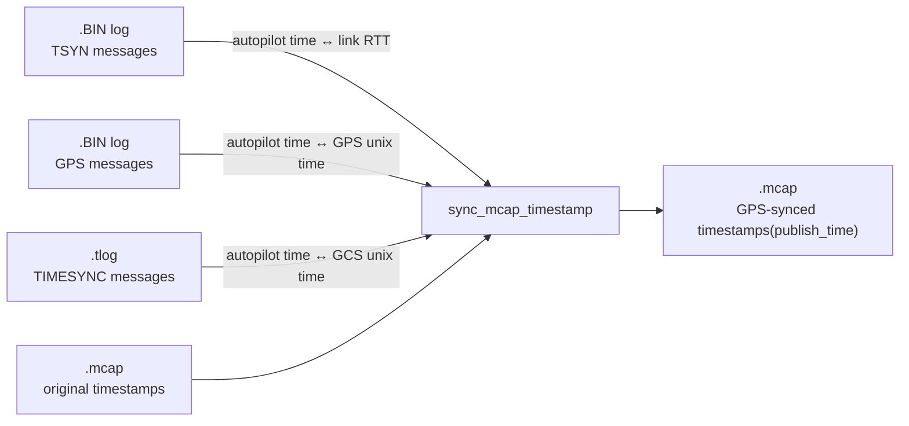

# ArduPilot Log Timesync

Synchronize and rewrite the timestamps in an MCAP log using GPS-accurate time, cross-referenced from an ArduPilot dataflash log (`.BIN`) and a ground-control-station telemetry log (`.tlog`).

## The Problem
Common logs from an Ardupilot setup:
*   **`.BIN` (Autopilot):** Runs on its own internal clock (`TimeUS`), but records precise GPS fixes.
*   **`.tlog` (Telemetry):** Stamped by the ground control station's local unix clock.
*   **`.mcap` (GCS additional Application):** Stamped by the companion computer's local unix clock, which frequently drifts or lacks NTP sync.

This tool chains all three logs together, calculates and subtracts telemetry transmission latency, and updates the `.mcap` file's **`publish_time`** with trusted, GPS-derived unix time.

## How It Works



1. **Alignment:** Maps the `.mcap` timestamps to the autopilot's internal clock using `.tlog` `TIMESYNC` packets.
2. **Latency Correction:** Subtracts half of the link's round-trip time (from `.BIN` `TSYN` messages) to correct for one-way latency.
3. **GPS Mapping:** Translates the corrected autopilot time into absolute GPS unix time using high-quality `.BIN` `GPS` fixes (`HDOP ≤ 2.5` and `Satellites ≥ 4`).
4. **Output:** Writes a new `*_synced.mcap` file preserving all original channels, data, and `log_time`, but with corrected `publish_time` stamps.

## Usage

```bash
./sync.py <bin_path> <tlog_path> [mcap_path] [flags]

```

### Arguments & Options

| Argument / Flag | Type | Description |
| --- | --- | --- |
| `bin_path` | Positional | Path to the autopilot's `.BIN` dataflash log. |
| `tlog_path` | Positional | Path to the ground control station's `.tlog` file. |
| `mcap` | Positional | Path to the input `.mcap` log. *(Default: `logs/log.mcap`)* |
| `--no-overlap-check` | Flag | Skips the safety validation that ensures the `.tlog` and `.mcap` files share an overlapping time window - the warning message. |

### Example

```bash
./sync.py logs/00000001.BIN logs/flight.tlog logs/flight_data.mcap

```

This will output `logs/flight_data_synced.mcap`.

## Performance & Guardrails

* **Parallel Processing:** The script reads `.BIN` and `.tlog` files concurrently using a multi-process pool to accelerate parsing speed.
* **Fast-Fail:** The program will immediately terminate and notify you if essential tracking packets (`TSYN`, `GPS`, or `TIMESYNC`) are entirely missing from your logs.
* **Autopilot Restarts:** If the autopilot rebooted mid-flight, the script automatically detects the clock reset and discards stale sync points prior to the restart.

## Building a Standalone Binary

To compile the script into a portable, single-file executable using Nuitka:

```bash
./build.sh
```
