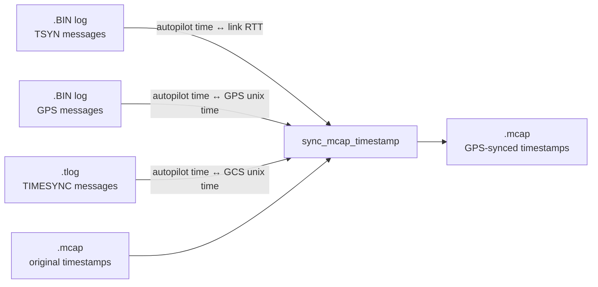

# ArduPilot Log Timesync

Rewrite the timestamps in an MCAP log so they match GPS-accurate time — cross-referenced from an ArduPilot dataflash log (`.BIN`) and a ground-control-station telemetry log (`.tlog`).

## The problem

A typical setup for logging a robot/drone flight ends up with three logs that each run on their own clock:

| Log | Source | Clock |
|---|---|---|
| `.BIN` | Autopilot (ArduPilot dataflash) | Free-running `TimeUS`, but also carries GPS fixes |
| `.tlog` | Ground control station | Its own local system unix clock |
| `.mcap` | Companion computer | Its own local system unix clock |

None of these clocks agree with each other, and system clocks can drift or simply be wrong if the machine isn't NTP-synced. The one clock you *can* trust is GPS time, which only shows up in the autopilot log. This tool chains all three logs together so the messages in your `.mcap` file end up stamped with GPS-derived unix time instead of whatever the recording computer's clock happened to say.

## How it works



For every message in the `.mcap` file:

1. Its recorded unix timestamp is matched against the `.tlog` **TIMESYNC** table to estimate the corresponding autopilot clock time.
2. The telemetry link's round-trip time at that moment (from the `.BIN` **TSYN** messages) is halved and subtracted, correcting for one-way transmission delay.
3. That corrected autopilot time is mapped through the `.BIN` **GPS** messages to get an accurate GPS-derived unix timestamp.
4. The message is written to a new `.mcap` file with the corrected timestamp; everything else (topics, schemas, channels, data) is preserved as-is.

All lookups interpolate linearly between the two nearest known sync points (extrapolating at the edges), and GPS fixes are only trusted when `HDOP ≤ 2.5` and satellite count `≥ 4`. Autopilot reboots detected mid-`.tlog` are handled by discarding the stale sync points that came before the restart.


## Usage

```bash
./sync.py <bin_path> <tlog_path> <mcap>
```

| Argument | Description |
|---|---|
| `bin_path` | Path to the autopilot's `.BIN` dataflash log |
| `tlog_path` | Path to the ground control station's `.tlog` file |
| `mcap` | Path to the `.mcap` log to correct (default: `logs/log.mcap`) |

Example:

```bash
./sync.py logs/00000001.BIN logs/flight.tlog logs/log.mcap
```

This produces `logs/log_synced.mcap` alongside the original file.

## Building a standalone binary

A one-file executable can be built with [Nuitka](https://nuitka.net/):

```bash
./build.sh
```

## Limitations

- Exits early if `TSYN`, `GPS`, or `TIMESYNC` messages aren't present in the supplied logs.
